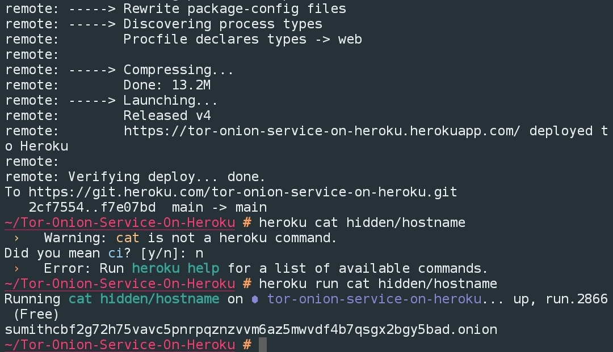

## Tor-Onion-Service-On-Heroku
 


### Prerequisites
    
- 1 . `nodejs`
- 2 . `tor` - v3
- 3 . `php`
- 4 . `git`
- 5 . `heroku CLI`


### Install Heroku


- 1 . Create an account on  **[https://heroku.com](https://heroku.com)**.
- 2 . Install the Heroku CLI on your computer: <br/>**[https://devcenter.heroku.com/articles/heroku-cli](https://devcenter.heroku.com/articles/heroku-cli)**. 
<br/>Check that you have the `heroku-cli` installed by checking the version number in your terminal:
```bash
heroku --version
```
- 3 . Connect the `Heroku CLI` to your account by writing the following command in your terminal and follow the instructions on the command line:
```bash
heroku login
```

### Quick Start

- 1 . Create a new project, for example in my case  `Tor-Onion-Service-On-Heroku`.

- 2 . Clone the repo with below command
```bash
git clone https://github.com/sumithemmadi/Tor-Onion-Service-On-Heroku.git
cd Tor-Onion-Service-On-Heroku
```
- 3 . Create a heroku application
```bash
heroku apps:create App-Name
```
-  `heroku apps:create App-Name` this command creates the application as well as a git remote, that you can use to push your code to Heroku:
 
-  _Note: replace `App-Name` with  any other name._
```bash
$ heroku apps:create tor-onion-service-on-heroku
Creating ⬢ tor-onion-service-on-heroku... done
https://tor-onion-service-on-heroku.herokuapp.com/ | https://git.heroku.com/tor-onion-service-on-heroku.git
```
- 4 . Now enter the below command

```bash
heroku buildpacks:add --index 1 heroku-community/apt
```
- Add this buildpack to heroku.
This buildpack is used to install packages like  `tor` and `nodejs` in heroku application which are mentioned in  `Aptfile` file.

- 5 . Copy your website `index.html` file to the folder `site`</br>

- 6 . Copy the following files to `hidden` folder.</br> 

   - `hostname`
   - `hs_ed25519_public_key`
   - `hs_ed25519_secret_key`

- If you don't know where these files stored refer to **[https://2019.www.torproject.org/docs/tor-onion-service](https://2019.www.torproject.org/docs/tor-onion-service)**
  

- 7 . Deploy your changes to heroku
```bash
git add .
git commit -am "Tor hidden service"
git push heroku
```

- _Now your app is accessible over Tor_
## To know your .onion address
- Run the below command on terminal
```
heroku run cat hidden/hostname
```
-  Output :-


- 
### My app

-  **[https://tor-onion-service-on-heroku.herokuapp.com/](https://tor-onion-service-on-heroku.herokuapp.com/)**
  
